# Project Description

The Quest Aroma Café is your digital oasis for premium coffee blends and delectable bites. Dive into a world of rich aromas and flavors curated to elevate your coffee experience. At Quest Aroma Café, our website invites you on a journey through a scrollable home menu, showcasing our tantalizing coffee blends and mouthwatering bites. Learn more about our passion for perfection in the "About Us" section, where we share our story and dedication to quality. Need to get in touch? Find our contact details easily in the "Contact Us" section, where we're always ready to connect with fellow coffee enthusiasts.

## Features
+ Home
+ Menu
+ About Us 
+ Contact Us 

## Screen Captures

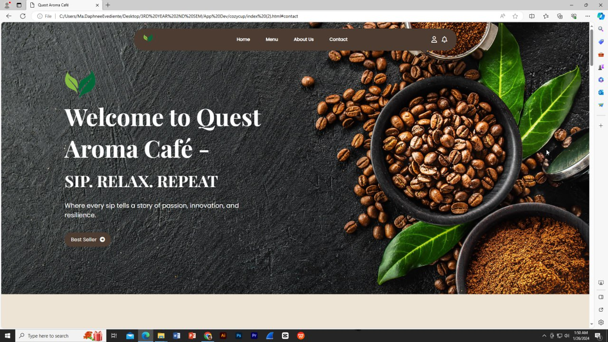

Welcome to Quest Aroma Café's digital home, where every scroll unveils the essence of our brand. Here, you'll discover our logo proudly displayed, symbolizing our commitment to excellence in every cup. As you navigate through our site, let our tagline "Sip. Relax. Repeat." guide you on a sensory adventure. At the top, our header offers easy access to our home, menu, about us, and contacts inviting you to learn more about Quest Aroma Café. 

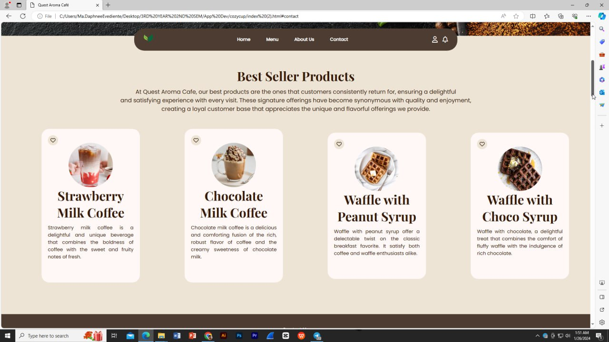

Discover our Best Sellers section, where we showcase the cream of the crop from our curated collection. Dive into a handpicked selection of products that have captured the hearts and taste buds of our customers. Each item comes with a concise name and a tantalizing description, offering you a glimpse into why these products are the talk of the town. Explore our Best Sellers and experience the finest offerings from our website.

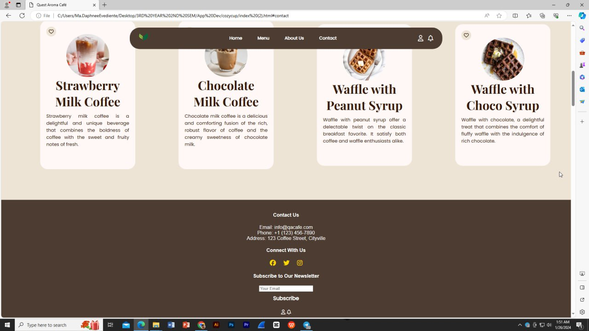

This section is located at the footer of the home page, where you can find contact information, social media icons, and a sign-up form for the cafe's newsletter.

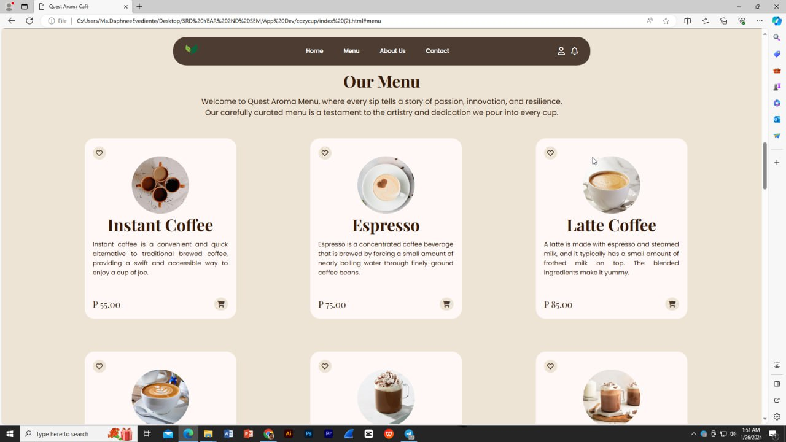

Welcome to the Quest Aroma cafe's menu, where your coffee journey begins! Explore our signature offerings, starting with our irresistible selection of Instant Coffee, Espresso, and Latte. Each option comes with a mouthwatering description, enticing you to indulge in its unique flavor profile. Don't forget to hit the favorite button to save your top picks, and when you're ready, simply add them to your cart to savor the experience. Prices are listed for your convenience, ensuring a seamless and satisfying coffee exploration.

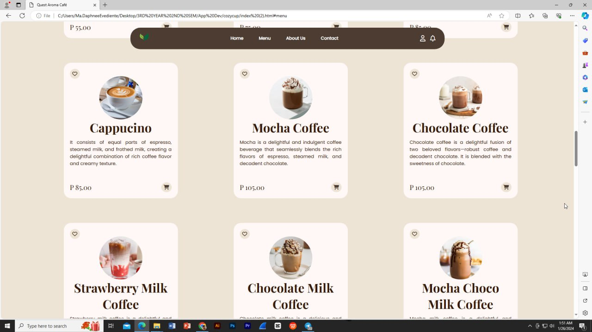

Continue your delightful journey through our menu with our tantalizing array of beverages. Indulge in the creamy richness of our Cappuccino, the decadent charm of Mocha Coffee. Each option promises a symphony of flavors to delight your senses. Whether you crave a classic favorite or a daring new blend, our menu offers something for every coffee connoisseur.

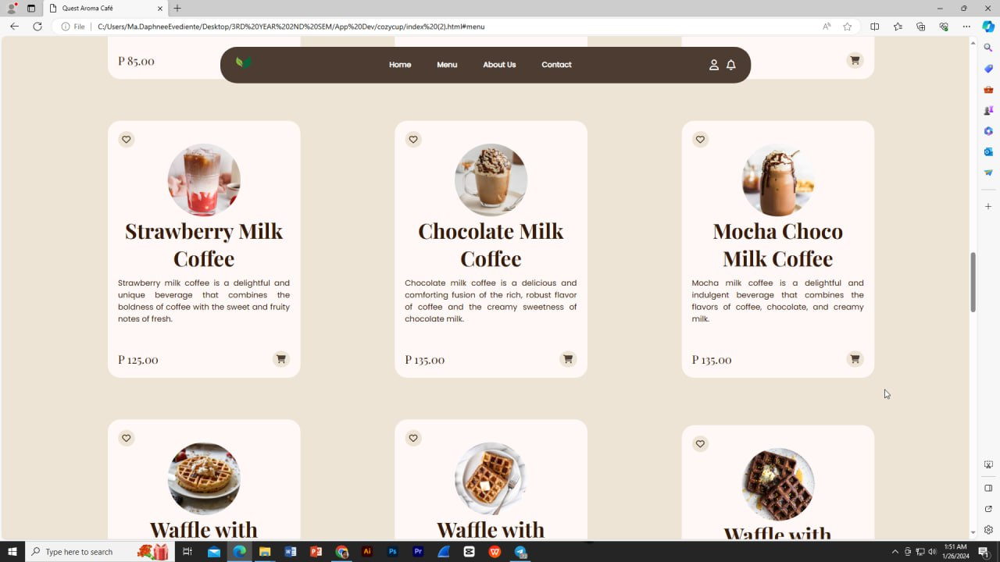

Here is the irresistible sweetness of Strawberry Milk Coffee, Chocolate Milk Coffee, and Mocha Choco Milk Coffee. It comes with a brief description of the following menu, prices, favorites, and add to cart button. 

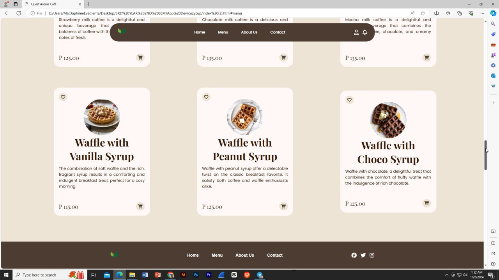

This is the pastry menu of Quest Aroma Café,  which includes a variety of pastries such as Waffle with Vanilla Syrup, Waffle with Peanut Syrup, Waffle with Choco Syrup. You can also find a brief description the pastry menu, prices, favorite and add to cart button. 

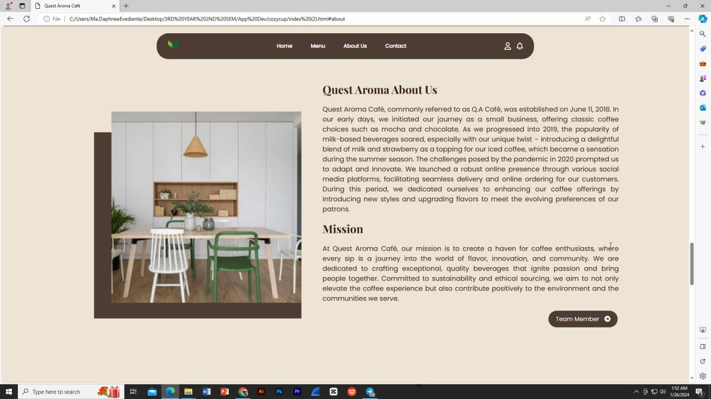

In this section, you can find a brief history, origins, values, and the commitment to quality of Quest Aroma Café. The mission of the cafe also indicated in this sectionn. It also consists a "Team Member" button and a header with navigation links. 

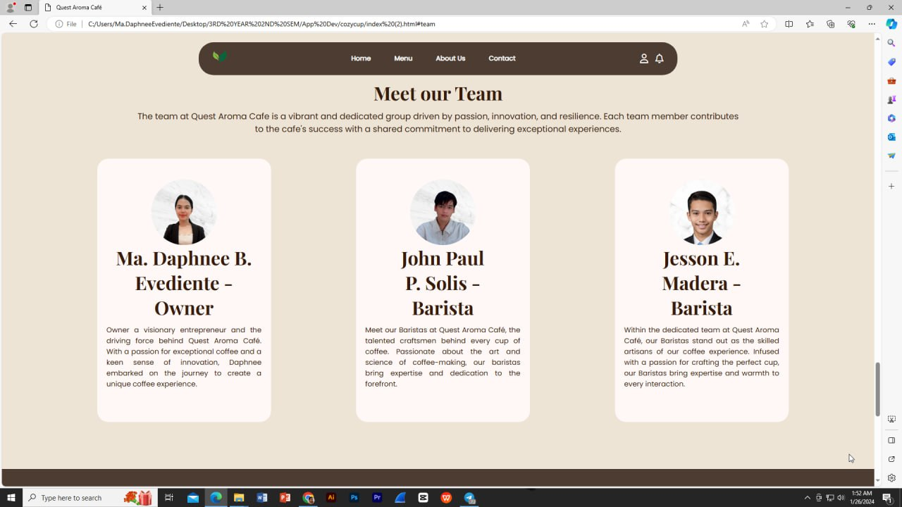

When the customer click the "Team Member" button, it will directly go to this page. In this section it consists a picture of the owner and staff of the Quest Aroma Café. Each team member has a short bio's. 

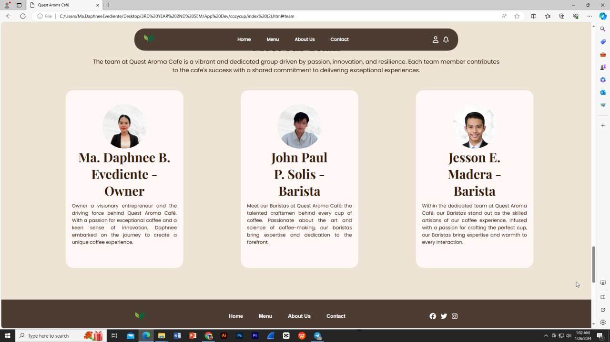

This section is located at the footer of the about us page, where you can find logo, social media icons, and a navigation links of the website.

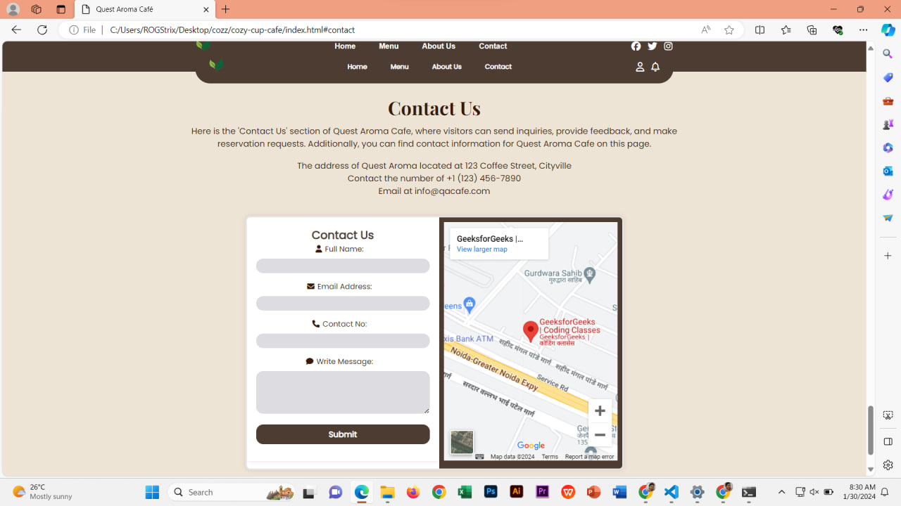

Our "Contact Us" section provides all the details you need to reach out to Quest Aroma Café. Whether you have questions, feedback, or simply want to say hello, we're here to assist you. Find our contact information, including phone number, email address, and social media links, conveniently listed for your convenience. Additionally, explore our interactive map navigation to easily locate our cafe's physical address. Customers can also submit an inquiries, feedback, or reservation requests.  

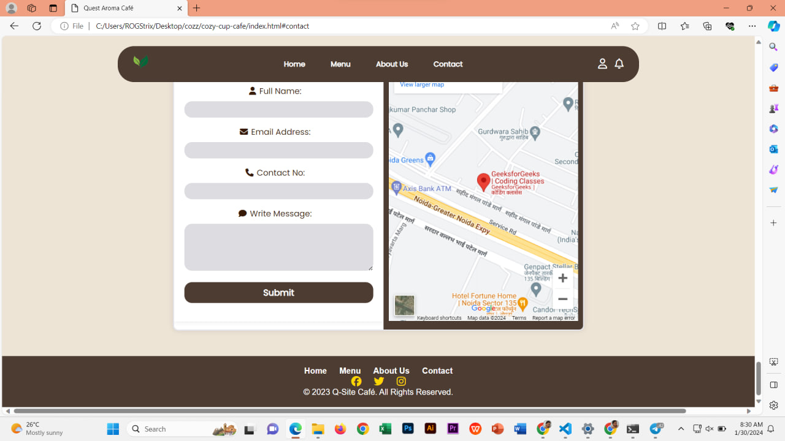

This section is located at the footer of the contact us page, where you can find logo, social media icons, and a navigation links of the website.

## About the Authors

**Name:** Ma. Daphnee B. Evediente  
**Email:** 202180090@psu.palawan.edu.ph

 

  

**Name:** John Paul Solis  
**Email:** 202180209@psu.palawan.edu.ph

   
