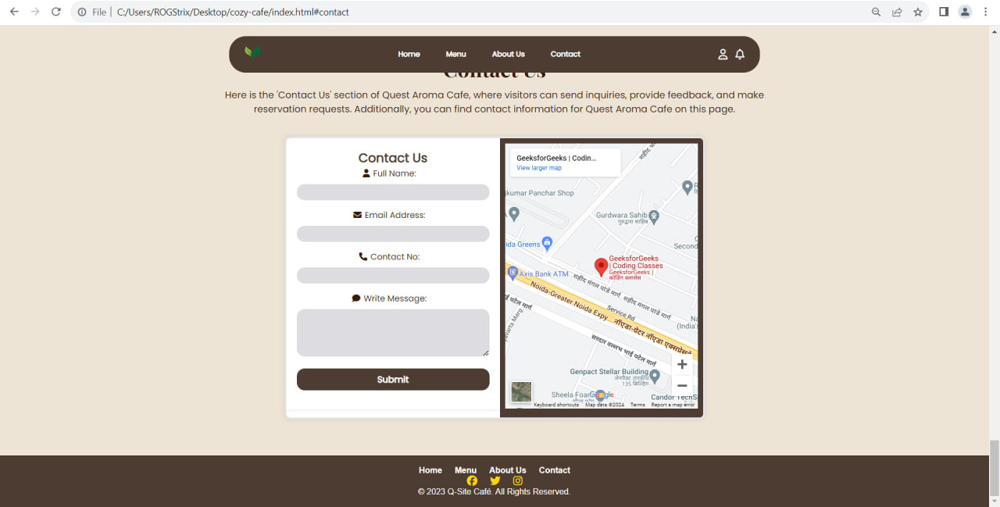

# Quest Aroma Cafe

## Table of Contents
- [Home](#home)
- [Menu](#menu)
- [About Us](#about-us)
- [Contact Us](#contact-us)

#### Brief Description About the Project

About us

Quest Aroma Café, commonly referred to as Q.A Café, was established on June 11, 2018. In our early days, we initiated our journey as a small business, offering classic coffee choices such as mocha and chocolate. As we progressed into 2019, the popularity of milk-based beverages soared, especially with our unique twist – introducing a delightful blend of milk and strawberry as a topping for our iced coffee, which became a sensation during the summer season. The challenges posed by the pandemic in 2020 prompted us to adapt and innovate. We launched a robust online presence through various social media platforms, facilitating seamless delivery and online ordering for our customers. During this period, we dedicated ourselves to enhancing our coffee offerings by introducing new styles and upgrading flavors to meet the evolving preferences of our patrons.

Mission 

At Quest Aroma Café, our mission is to create a haven for coffee enthusiasts, where every sip is a journey into the world of flavor, innovation, and community. We are dedicated to crafting exceptional, quality beverages that ignite passion and bring people together. Committed to sustainability and ethical sourcing, we aim to not only elevate the coffee experience but also contribute positively to the environment and the communities we serve.

Here is the interface of Quest Aroma Cafe: It has home, menu, about us, and contact. 

## Contact Us
Feel free to reach out to us! Whether you have questions, thoughts, or just want to share your experience, we'd love to hear from you.

- **Email:** QSiteCafe@yahoo.com

For more details, visit the [Contact Section](#contact-us).

---

**&copy; 2023 Q-Site Café. All Rights Reserved.**

Connect with us on social media:
- [Facebook](https://facebook.com/yourcafe)
- [Twitter](https://twitter.com/yourcafe)
- [Instagram](https://instagram.com/yourcafe)

